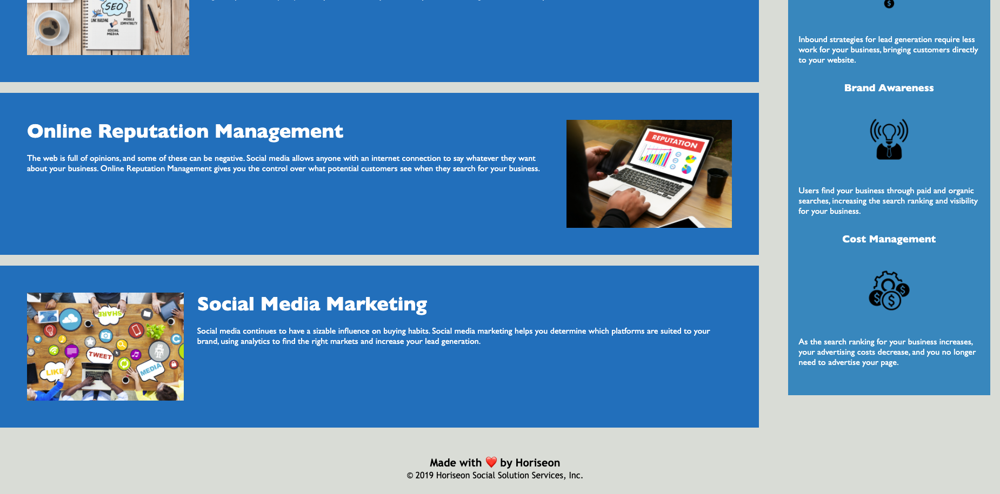

# Code Refactor Starter Code
GIVEN a webpage meets accessibility standards <br>
WHEN I view the source code <br>
THEN I find semantic HTML elements
WHEN I view the structure of the HTML elements<br>
THEN I find that the elements follow a logical structure independent of styling and positioning<br>
WHEN I view the image elements<br>
THEN I find accessible alt attributes<br>
WHEN I view the heading attributes<br>
THEN they fall in sequential order<br>
WHEN I view the title element<br>
THEN I find a concise, descriptive title<br>

Home Page: https://mooka0.github.io/horiseon-challenge/<br>




## Setup
```
git clone https://github.com/mooka0/horiseon-challenge.git
```

